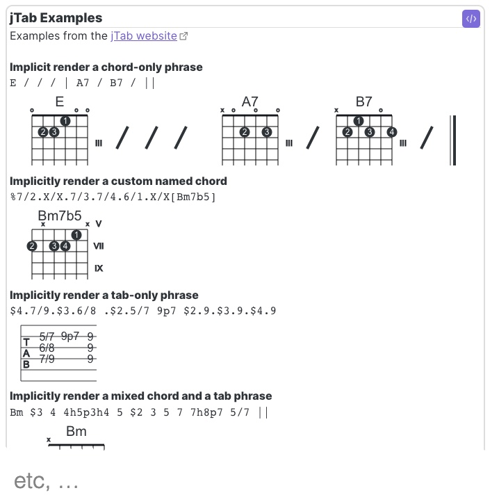

The Obsidian jTab plugin simply adds Obsidian codeblocks for jTab. The underlying rendering is completely handled by the [jTab](https://jtab.tardate.com/) library.

#### Quick Start 

__Codeblocks__
language       | description
---------------|-------------
jtab           | jTab will auto-detect chords, tabs, or both  
jtab-chordonly | Force suppress tabs if the jtab has both
jtab-tabonly   | Force supress chords if the jtab has both
jtab-examples  | Type an empty codeblock to see all of the [jTab examples](https://jtab.tardate.com/examples.htm)

Be aware that the width of jTab renderings are as long as you make the jTab. It's up to you to break long jTab across multiple lines.

FYI, the underlying jTab library isn't responsive (i.e., auto-resizing based on mobile, broswer widths) so your mileage may vary on mobile devices.

#### Obsidian jTab Enhancements
1. __Supports multiple jTab lines per codeblock__
   Each jTab line in a codeblock will be individually rendered
2. __Supports markdown in codeblocks__
   Lines starting with #<space> ('# ') are rendered as markdown inside the rendered codeblock
3. __Quick access to jtab-examples__
   Change any jtab codeblock language to jtab-examples (with your jTab still inside) and it will render the examples AND preserve your jTab when you go to edit it again.

#### Examples
The [jTab Home Page](https://jtab.tardate.com/) has plenty of [examples](https://jtab.tardate.com/examples.htm).

Typing an empty jtab-examples codeblock will render all of those examples in your
~~~~
```jtab-examples
```
~~~~

#### Rendered jTab

~~~~
```jtab
Bm $3 4 4h5p3h4 5 $2 3 5 7 7h8p7 5/7 ||
```
~~~~


~~~~
```jtab-chordonly
Bm $3 4 4h5p3h4 5 $2 3 5 7 7h8p7 5/7 ||
```
~~~~


~~~~
```jtab-tabonly
Bm $3 4 4h5p3h4 5 $2 3 5 7 7h8p7 5/7 ||
```
~~~~


~~~~
```jtab-examples
```
~~~~

