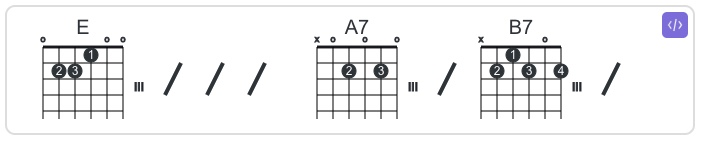
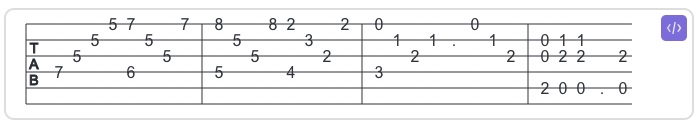

### Obsidian jTab Guide

Obsidian jTab adds the ability to show guitar chords and tabs directly in your notes.

It uses the [jTab](https://jtab.tardate.com/) library to render the chords/tabs.

#### jTab Codeblocks

language       | description
---------------|-------------
jtab           | jTab will auto-detect chords, tabs, or both
jtab-examples  | Type an empty codeblock to see all of the [jTab examples](https://jtab.tardate.com/examples.htm)

#### Enhancements Specific to Obsidian jTab
1. __Supports multiple jTab lines per codeblock__
   Each jTab line in a codeblock will be individually rendered
2. __Supports markdown in codeblocks__
   Lines starting with `#<space>` (`# `) are rendered as markdown inside the rendered codeblock
3. __Quick access to jtab-examples__
   Change any jtab codeblock language to jtab-examples (with your jTab still inside) and it will render the examples AND preserve your jTab when you go to edit it again.

#### Learning jTab
The [jTab Home Page](https://jtab.tardate.com/) has a [notation guide](https://jtab.tardate.com/index.htm#notation) and plenty of [examples](https://jtab.tardate.com/examples.htm).

You can put all of the examples from the jTab website directly into your notes by simply adding this:
~~~
\`\`\`jtab-examples
\`\`\`
~~~

#### jTab Rendering Caveats
* __Not "responsive"__
  The underlying jTab library isn't responsive (i.e., auto-resizing based on mobile, broswer widths) so your mileage may vary on mobile devices.
* __Rendering too wide?__
  The width of jTab renderings are as long as you make the jTab. It's up to you to break long jTab across multiple lines.
* __What about chordonly and tabonly classes mentioned on the jTab site?__
  The jTab library auto-detects if there are chords and/or tabs when rendereing jTab. On the examples page it mentions using chordonly and tabonly classes. They have no effect on the generated tab. They are only there to adust the height of the surrounding div to match the height of the generaged svg. With modern broswers these classes no longer needed.

#### Rendered jTab Examples

__jTab with only chords__
~~~~
```jtab
Bm $3 4 4h5p3h4 5 $2 3 5 7 7h8p7 5/7 ||
```
~~~~


__jTab with only tabs__ (haha)
~~~~
```jtab
$4.7 $3.5 $2.5 $1.5 $1.7.$4.6 $2.5 $3.5 $1.7 | $1.8.$4.5 $2.5 $3.5 $1.8 $1.2.$4.4 $2.3 $3.2 $1.2 | $1.0.$4.3 $2.1 $3.2 $2.1 . $1.0 $2.1 $3.2 | $2.0.$3.0.$5.2 $2.1.$3.2.$5.0 $2.1.$3.2.$5.0 . $3.2.$5.0
```
~~~~


__jTab with chords and tabs__
~~~~
```jtab
Bm $3 4 4h5p3h4 5 $2 3 5 7 7h8p7 5/7 ||
```
~~~~


__jTab examples codeblock__
~~~~
```jtab-examples
```
~~~~

